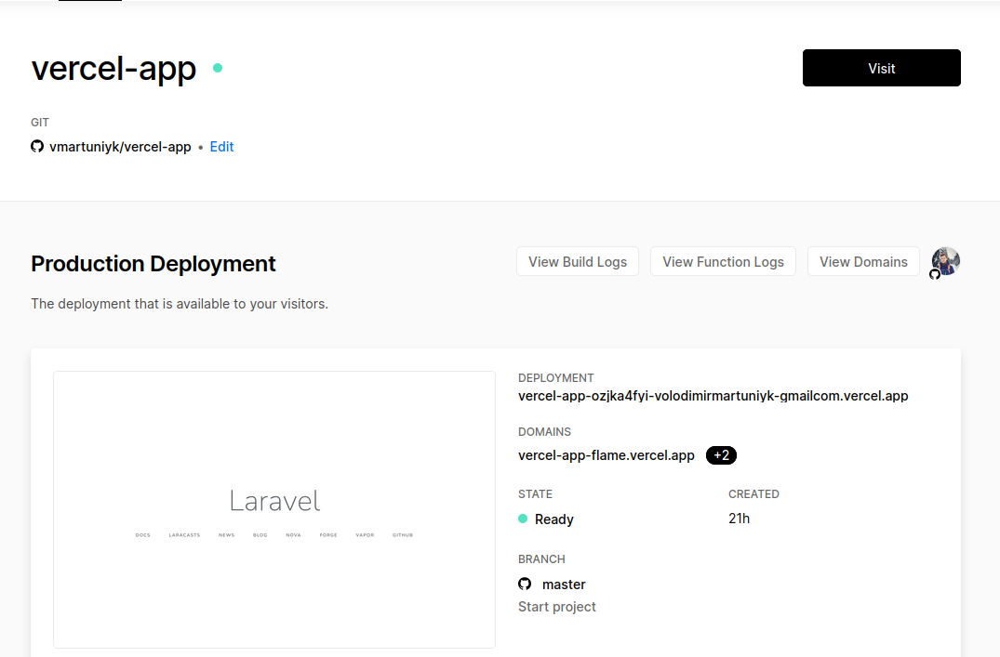
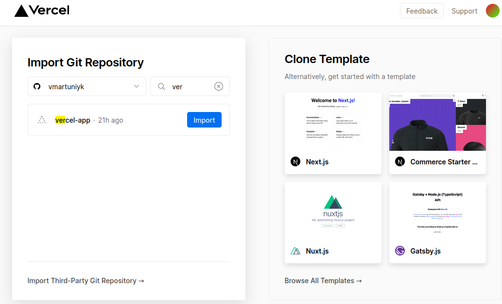
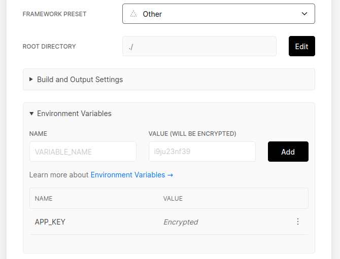

> You need to show some of your test work to the customer or want to place your own pet project. And you don't want to spend a lot of money and time on it. The service of [Vercel](vercel.com/) will come to your aid 

### Step - 1. Create new laravel project ?

You can create new laravel project using Laravel's CLI tool or past simple command 
to your terminal
```js
composer create-project --prefer-dist laravel/laravel:^7.0 vercel-template
```

### Step - 2. Create 3 new files on project folder ?
1. `api/index.php` 
2. `vercel.json` 
3. `.vercelignore` 
4. Happy coding 🎉🙌

## api/index.php
You need create folder with name `api` and create new file in this folder `index.php`.
In this file need put with code .

```js
<?php

// Forward Vercel requests to normal index.php
require __DIR__ . '/../public/index.php';
```
This code will help the Versel to perform everything in our public folder .

## .vercelignore
Need create new file in main project folder with name `.vercelignore` and put this code to folder
```js
/vendor
```
This comand means not load files inside direcory /vendor when we deploy our code.

## vercel.json
Create new file `vercel.json ` and put this code to file

```js
{
    "version": 2,
    "builds": [
        { "src": "/api/index.php", "use": "vercel-php@0.3.1" },
        { "src": "/public/**", "use": "@vercel/static" }
    ],
    "routes": [
        {
            "src": "/(css|js|images)/(.*)",
            "dest": "public/$1/$2"
        },
        {
            "src": "/(.*)",
            "dest": "/api/index.php"
        }
    ],
    "env": {
        "APP_CONFIG_CACHE": "/tmp/config.php",
        "APP_EVENTS_CACHE": "/tmp/events.php",
        "APP_PACKAGES_CACHE": "/tmp/packages.php",
        "APP_ROUTES_CACHE": "/tmp/routes.php",
        "APP_SERVICES_CACHE": "/tmp/services.php",
        "VIEW_COMPILED_PATH": "/tmp",

        "CACHE_DRIVER": "array",
        "LOG_CHANNEL": "stderr",
        "SESSION_DRIVER": "cookie"
    }
}

```
After all this stuf need to upload your project to Github or Bitbucket

### Login to Vercel and connect Git

To automate the deployment process, you need to go to the Versell site and connect your github repo.
After login need click to Overview tab and press button New Project.


And enter Import. Next step `Select your personal account` and click `Continue`.
And you will see windows where you can add your Environment Variables for example APP_KEY or something else. After added all variables need click button `DEPLOY`.


And after one or two minutes you can see your new website online.


Now you can change your site and create new features, create commits, push to github and after that automaticly
you code upload to vercel server.
Thats a greate result for development 🎉🙌

My sample project on Vercel deploy <a href="https://video-games.vercel.app" target="_blank">Video games site</a> 
<a href="https://github.com/vmartuniyk/video-games" target="_blank">Code on Github</a>

